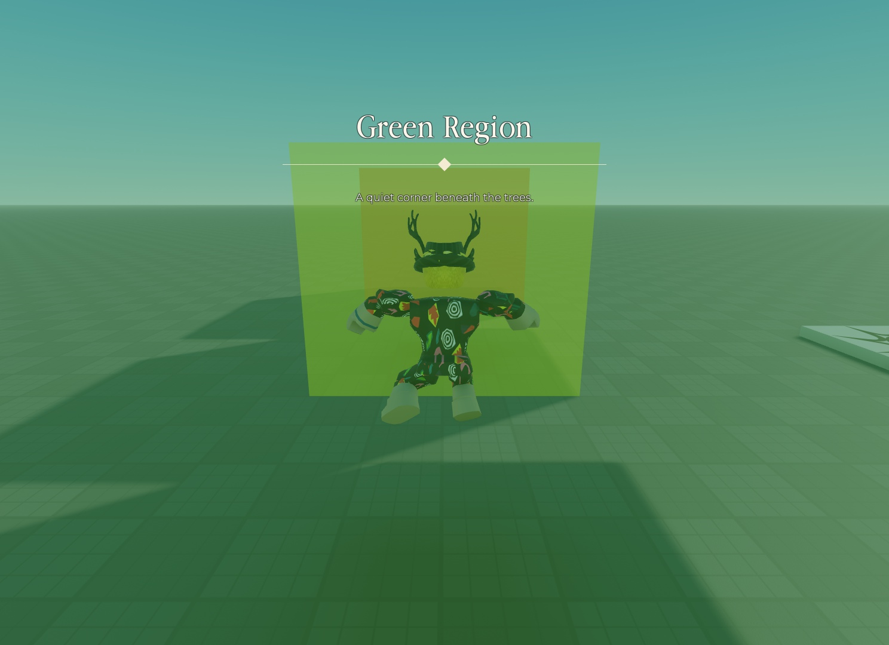

# LandMark

A Roblox region system with animated banners, optional music, and per-player lighting.

**[Play the LandMark Showcase on Roblox](https://www.roblox.com/games/130107249243262/landMark-Showcase)**



Entry and exit banners appear at the top center of the screen with a transparent background. A large region name sits above a diamond framed by two horizontal lines, with the description underneath. All interface text is in English. Entry sounds, exit sounds, looping region themes, and custom lighting can each be enabled independently.

## Installation

- `ReplicatedStorage.RegionSystem`: a **ModuleScript** containing `src/RegionSystem/init.luau`.
- `ReplicatedStorage.RegionSystem.Config`: a child **ModuleScript** containing `src/RegionSystem/Config.luau`.
- `ReplicatedStorage.RegionSystem.Audio`: a folder containing **Sound** templates, using the structure and properties in `src/RegionSystem/Audio.model.json`.
- `StarterPlayer.StarterPlayerScripts.RegionClient`: a **LocalScript** containing `src/RegionClient.client.luau`.
- `Workspace.Regions`: a folder containing your region parts. `BasePart` objects inside subfolders are included.

Add a **String** attribute named `RegionId` to each region part. Use `Green`, `Yellow`, or `Red` for the included presets. Part names do not matter: the banner uses the `Name` field in Config. Parts sharing a `RegionId` act as one region. To disable a part, add a **Boolean** attribute named `Enabled` and set it to `false`; set it to `true` or remove the attribute to enable it again.

For invisible, nonblocking volumes, set `Anchored = true`, `CanCollide = false`, and `Transparency = 1`. A part without a `RegionId` becomes an independent region using `Defaults`. IDs without a matching Config entry also use `Defaults`.

The optional Rojo project, `default.project.json`, maps the scripts and sound templates to these Studio locations. Create your region parts in Studio; they are not included in the project file.

## Configuration

Edit an entry such as `Config.Regions.Green`, or add a new key and give your parts the matching `RegionId`:

```lua
Green = {
    Name = "Green Region",
    Description = "A quiet corner beneath the trees.",
    Priority = 0,
    Intro = { Enabled = true, Duration = 2.4 },
    Outro = { Enabled = true, Duration = 1.6 },
    IntroMusic = { Enabled = true },
    OutroMusic = { Enabled = true },
    Theme = { Enabled = false },
    Lighting = {
        Enabled = true,
        ClockTime = 9,
        Brightness = 2,
        Ambient = Color3.fromRGB(90, 115, 95),
    },
}
```

`Intro` and `Outro` control the visual banners; their sounds have separate settings. Disable any feature with `Enabled = false` or set the entire feature to `false`, such as `Theme = false`, `Lighting = false`, or `Intro = false`. Removing a field falls back to `Defaults`, which may leave that feature enabled. Nested tables are not merged.

Supported lighting properties are `Ambient`, `OutdoorAmbient`, `Brightness`, `ClockTime`, `FogColor`, `FogStart`, `FogEnd`, `ExposureCompensation`, `ColorShift_Top`, and `ColorShift_Bottom`. Overridden values are restored when the player leaves. `LightingTransition` sets the transition duration in seconds.

TweenService animates the title and description with staggered slides and fades. The diamond scales and rotates while the lines extend outward from the center. At the end, the lines retract and the text fades away. Exit banners reverse the panel motion and diamond rotation. `FadeTime` sets the opening and closing animation duration in seconds; use `0` for instant transitions. A new region transition cancels the previous banner's animations.

## Audio

Edit the sounds directly beneath the module in Explorer:

```text
ReplicatedStorage.RegionSystem.Audio
├─ Default
│  ├─ Intro (Sound)
│  ├─ Outro (Sound)
│  └─ Theme (Sound)
├─ Green
│  ├─ Intro (Sound)
│  ├─ Outro (Sound)
│  └─ Theme (Sound)
├─ Yellow
│  ├─ Intro (Sound)
│  ├─ Outro (Sound)
│  └─ Theme (Sound)
└─ Red
   ├─ Intro (Sound)
   ├─ Outro (Sound)
   └─ Theme (Sound)
```

`Default`, `Green`, `Yellow`, and `Red` are **Folder** objects. Each region folder name matches its `RegionId`. Set a Sound's `SoundId`, `Volume`, and `PlaybackSpeed` in Properties, and add sound effects as its children. Use Roblox audio assets that your experience has permission to play.

If a region sound has an empty `SoundId`, the matching `Default` sound is used. For example, an empty `Green.Intro` falls back to `Default.Intro`. The included `Default.Intro` and `Default.Outro` have audio assigned, and entry and exit sounds are enabled in Config. Yellow also has an assigned, enabled theme; the other region themes are disabled. To add a theme, set `Theme.SoundId` in the region folder or `Default`, then set the corresponding `Theme.Enabled` to `true` in Config.

`IntroMusic.Enabled`, `OutroMusic.Enabled`, and `Theme.Enabled` control whether each sound plays. For backward compatibility, an explicit `Volume` in Config overrides the template volume. A nonempty `SoundId` in Config creates a standalone Sound; this legacy path does not copy the template's effects or `PlaybackSpeed`.

The module clones the selected Sound template, including its effects and audio properties, into the local `SoundService`. Original templates stay untouched beneath the module. Entry and exit sounds play once, while the theme loops for as long as the player stays inside. Previous playback clones are cleaned up during transitions. One-shot sounds have a cleanup timeout of 120 seconds.

## Behavior and API

With the default `CheckInterval = 0.1`, the module checks whether the character's body parts overlap a region volume every 0.1 seconds. Accessories and equipped tools do not trigger regions. Entry fires once while the player remains inside, and fires again after leaving and reentering. When regions overlap, the highest `Priority` wins; ties keep the current region. Moving directly between regions shows the old region's exit banner followed by the new region's entry banner.

Effects run on each player's client. These visual and audio features do not require RemoteEvents. When loaded on the client, the module creates **BindableEvent** objects named `Entered` and `Exited` under `ReplicatedStorage.RegionSystem`. These local events do not replicate to the server or other players.

From a LocalScript:

```lua
local RegionSystem = require(game:GetService("ReplicatedStorage"):WaitForChild("RegionSystem"))

RegionSystem.Entered.Event:Connect(function(regionId, config, part)
    print("Entered", regionId, config.Name, part)
end)

RegionSystem.Exited.Event:Connect(function(regionId, config, part)
    print("Exited", regionId, config.Name, part)
end)

RegionSystem.Start()
```

The included `RegionClient` already calls `Start()`. `GetCurrentRegion()` returns `regionId, config, part` for the active region, or `nil` when outside all regions. `Stop()` disconnects detection, removes the UI and sounds, and restores lighting. Call `Start()` again to restart. Character death clears the effects, and detection continues after respawning.

## Testing

`tests/RegionSystem.spec.luau` contains 27 runtime checks, run from a LocalScript in Studio Play mode. They cover entry and exit, region priority, rotated parts, shared region IDs, lighting restoration, audio cleanup, stopping, and restarting. Audio checks use built-in Roblox sounds at zero volume; verify experience permissions separately for your own audio assets.

Copy the test file into a ModuleScript named `ReplicatedStorage.RegionSystemTest`, then run it from a test LocalScript:

```lua
local run = require(game:GetService("ReplicatedStorage").RegionSystemTest)
local result = run()
print(result.passed, result.failure)
```

The test temporarily moves the character, then restores its position and settings and removes the test fixtures. Run it in a Studio Play session. Keep the test ModuleScript and its runner out of the published game.
